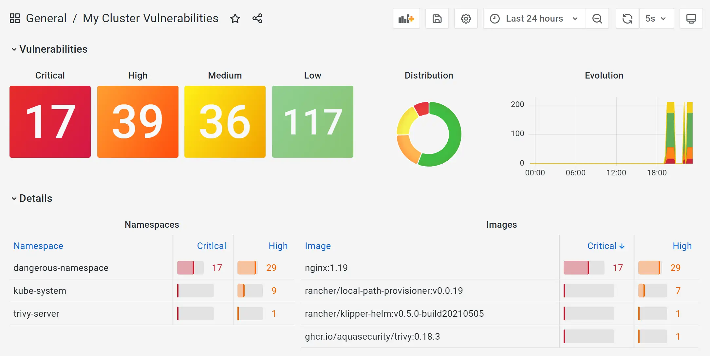

# Kubernetes Continuous Image Scanning System

Kciss (from french famous fruit "cassis") service scans regulary the container images used within the local Kubernetes cluster, aggregates vulnerabilities statistics for the namespaces and images and exposes results to Prometheus.

The security scanning component is performed by [Trivy](https://github.com/aquasecurity/trivy), deployed in client-server mode.

Users can easily create alerts based on vulnerabilities found in their clusters workloads, or build vulnerabilities dashboards in Grafana such as this one:


# Installation

KCISS is deployed with a Helm Chart. Add the KCISS helm repository
```shell
helm repo add kciss https://sokube.github.io/kciss/
```

Make sure the KCISS Helm Chart is listed
```shell
helm search repo kciss
```

Deploy the Helm chart with default values
```shell
helm install -n kciss --create-namespace kciss-demo kciss/kciss
```

Or, deploy the Helm chart with custom values (my-values.yaml)
```shell
helm install -n kciss --create-namespace kciss-demo -f my-values.yaml kciss/kciss 
```

# Demo

Please note that the KCISS chart won't deploy Prometheus or Grafana. A complete demo of KCISS (running on a k3d cluster) with a Prometheus instance and a fully provisioned Grafana (as shown above) can be deployed with:

```shell
k3d cluster create --config=k3d-cluster-config.yml 

helm repo add kciss https://sokube.github.io/kciss/

helm install -n kciss --create-namespace kciss-demo kciss/
kciss

kubectl apply -f k8s/grafana-and-prometheus
```

Wait for all the pods to be up & running and open a web browser on http://localhost:443/d/jJAl3im7z/my-cluster-vulnerabilities?orgId=1&refresh=5s
(Note: grafana is using admin/admin by default)